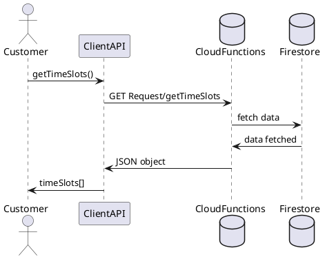

```plantuml

@startuml
actor Customer
participant ClientAPI
database CloudFunctions
database Firestore

Customer -> ClientAPI : getTimeSlots()
ClientAPI -> CloudFunctions : GET Request/getTimeSlots
CloudFunctions -> Firestore : fetch data
Firestore -> CloudFunctions : data fetched
CloudFunctions -> ClientAPI : JSON object
ClientAPI -> Customer : timeSlots[]
```

